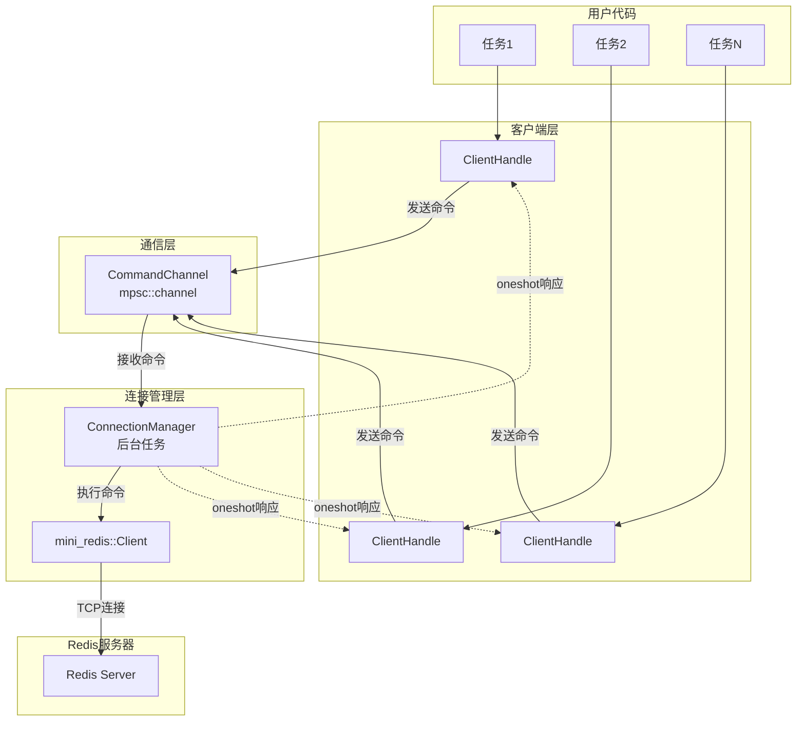
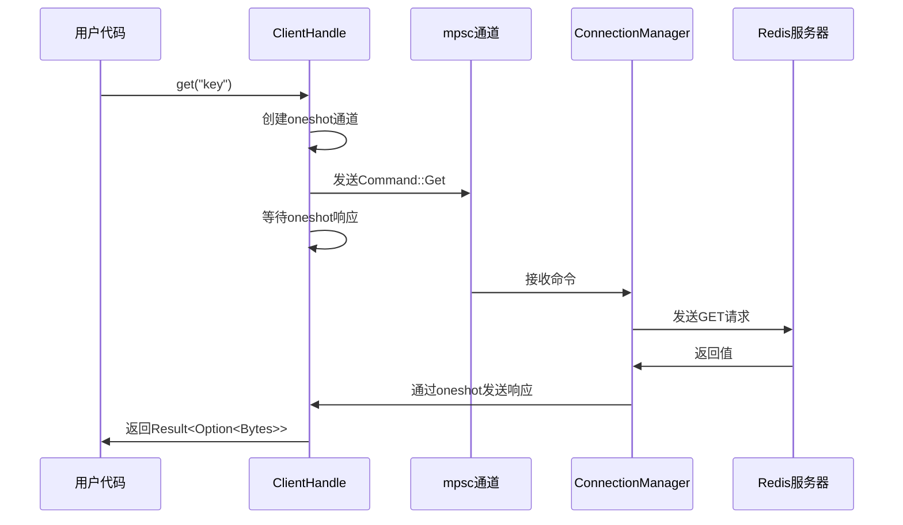

# 设计文档

## 概述

异步Redis客户端采用基于消息传递的架构，通过单一的后台任务管理与Redis服务器的连接，多个客户端句柄通过mpsc通道发送命令。这种设计确保了线程安全、高效的资源利用和简洁的API。

核心设计理念：
- 使用 Tokio 异步运行时提供高性能的异步I/O
- 采用消息传递模式避免共享状态和锁竞争
- 提供轻量级、可克隆的客户端句柄
- 利用 mini-redis 库处理Redis协议细节

## 架构

### 系统架构图



### 架构说明

1. **客户端句柄层**: 用户通过 `ClientHandle` 与客户端交互，每个句柄都是轻量级的，可以克隆并在任务间传递
2. **通信层**: 使用 mpsc 通道传递命令，使用 oneshot 通道返回响应
3. **连接管理层**: 单一后台任务管理实际的Redis连接，串行处理所有命令
4. **协议层**: 使用 mini-redis 库处理Redis协议的编解码

## 组件和接口

### 1. RedisClient 结构体

主要的客户端结构，包含命令发送端。

```rust
pub struct RedisClient {
    tx: mpsc::Sender<Command>,
}
```

**方法:**
- `pub async fn connect(addr: &str) -> Result<Self>`
  - 连接到Redis服务器
  - 启动后台连接管理任务
  - 返回客户端实例

- `pub async fn get(&self, key: String) -> Result<Option<Bytes>>`
  - 发送GET命令
  - 等待并返回响应

- `pub async fn set(&self, key: String, value: Bytes) -> Result<()>`
  - 发送SET命令
  - 等待并返回响应

**克隆语义:**
- 实现 `Clone` trait
- 克隆只复制发送端，不创建新连接
- 所有克隆共享同一个后台连接管理器

### 2. Command 枚举

表示支持的Redis命令。

```rust
enum Command {
    Get {
        key: String,
        resp: Responder<Option<Bytes>>,
    },
    Set {
        key: String,
        value: Bytes,
        resp: Responder<()>,
    },
}
```

**设计决策:**
- 每个命令变体包含命令参数和响应通道
- 使用 oneshot 通道确保响应返回给正确的调用者
- 枚举设计便于未来扩展更多命令

### 3. Responder 类型别名

```rust
type Responder<T> = oneshot::Sender<mini_redis::Result<T>>;
```

简化响应通道的类型声明。

### 4. ConnectionManager (后台任务)

在 `connect` 方法中启动的后台任务，负责：
- 维护与Redis服务器的连接
- 从命令通道接收命令
- 执行命令并发送响应
- 在通道关闭时清理资源

```rust
async fn connection_manager(
    mut client: mini_redis::client::Client,
    mut rx: mpsc::Receiver<Command>,
) {
    while let Some(cmd) = rx.recv().await {
        match cmd {
            Command::Get { key, resp } => {
                let result = client.get(&key).await;
                let _ = resp.send(result);
            }
            Command::Set { key, value, resp } => {
                let result = client.set(&key, value).await;
                let _ = resp.send(result);
            }
        }
    }
}
```

## 数据模型

### 命令流转



### 数据类型

- **键**: `String` - Redis键名
- **值**: `Bytes` - 使用 bytes crate 的高效字节类型
- **结果**: `mini_redis::Result<T>` - 统一的错误处理类型

## 错误处理

### 错误类型

客户端使用 `mini_redis::Result<T>` 作为返回类型，可能的错误包括：

1. **连接错误**: 无法连接到Redis服务器
2. **网络错误**: 连接中断或超时
3. **协议错误**: Redis协议解析失败
4. **通道错误**: 命令通道关闭（客户端已关闭）
5. **Redis错误**: Redis服务器返回的错误

### 错误处理策略

```rust
// 连接错误
pub async fn connect(addr: &str) -> Result<Self> {
    let client = mini_redis::client::connect(addr).await?;
    // ...
}

// 命令执行错误
pub async fn get(&self, key: String) -> Result<Option<Bytes>> {
    let (resp_tx, resp_rx) = oneshot::channel();
    let cmd = Command::Get { key, resp: resp_tx };
    
    self.tx.send(cmd).await
        .map_err(|_| "connection closed")?;
    
    resp_rx.await
        .map_err(|_| "connection closed")?
}
```

### 错误传播

- 网络和协议错误从 mini-redis 传播到用户
- 通道关闭错误转换为有意义的错误消息
- 所有错误都通过 Result 类型返回，不使用 panic

## 测试策略

### 单元测试

1. **命令构造测试**
   - 验证 Command 枚举的正确构造
   - 测试各种参数组合

2. **客户端克隆测试**
   - 验证克隆的客户端共享同一连接
   - 测试克隆后的独立操作

### 集成测试

1. **基本操作测试**
   - 测试 SET 和 GET 操作
   - 验证数据正确性

2. **并发测试**
   - 从多个任务同时发送命令
   - 验证响应正确匹配到调用者
   - 测试高并发场景下的稳定性

3. **错误处理测试**
   - 测试连接失败场景
   - 测试服务器不可用场景
   - 测试客户端关闭后的行为

4. **资源清理测试**
   - 验证客户端正确关闭
   - 检查没有资源泄漏
   - 测试优雅关闭

### 测试环境

- 需要运行Redis服务器（可使用 Docker）
- 使用 Tokio 测试运行时
- 考虑使用 mini-redis 的测试服务器

## 实现注意事项

### 性能考虑

1. **通道容量**: mpsc 通道使用合理的缓冲区大小（如32）平衡内存和吞吐量
2. **零拷贝**: 使用 `Bytes` 类型避免不必要的数据复制
3. **连接复用**: 单一连接处理所有命令，避免连接开销

### 并发安全

1. **无锁设计**: 使用消息传递而非共享状态
2. **响应匹配**: oneshot 通道确保响应返回给正确的调用者
3. **顺序保证**: 命令按发送顺序执行

### 资源管理

1. **自动清理**: 当所有 ClientHandle 被丢弃时，发送端关闭，后台任务自动退出
2. **优雅关闭**: 后台任务处理完所有待处理命令后才退出
3. **错误恢复**: 考虑未来添加自动重连机制

### 扩展性

设计支持未来扩展：
- 添加更多Redis命令（DEL, INCR, LPUSH等）
- 支持事务和管道
- 添加连接池支持
- 实现自动重连机制
- 支持Redis集群

## 依赖项

```toml
[dependencies]
tokio = { version = "1", features = ["full"] }
mini-redis = "0.4"
bytes = "1"
```

- **tokio**: 异步运行时和通道实现
- **mini-redis**: Redis协议实现和客户端基础
- **bytes**: 高效的字节缓冲区类型
